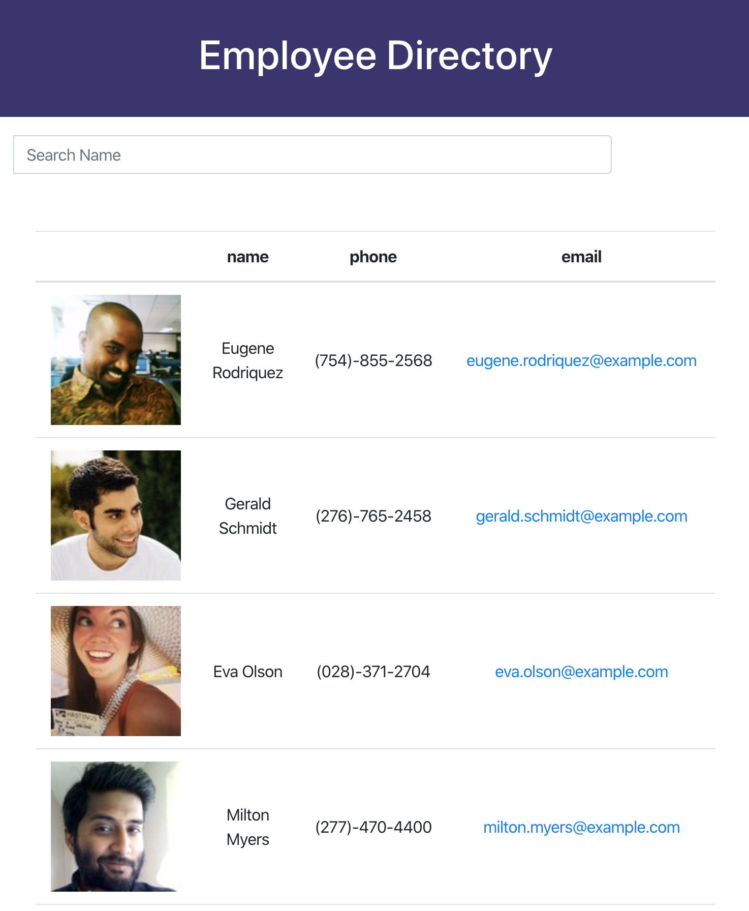

# Employee Directory

## Problem
Keepiong track of contact info is hard. When a supervisor needs to keep track of their employess, this app provides a way to do it. 

## Organization
This app is organized around the search bar at the top of the page. Users can search for a contact to quickly filter and find a specific person. 

## Instructions
This is a deployed app. You can see it in action at https://duquetteman.github.io/react-employee-directory/

## User Story

As a user, I want to be able to view my entire employee directory at once so that I have quick access to their information.

## Business Context

An employee or manager would benefit greatly from being able to view non-sensitive data about other employees. It would be particularly helpful to be able to filter employees by name.

## Deployed Link

https://duquetteman.github.io/react-employee-directory/

## Screenshot:

